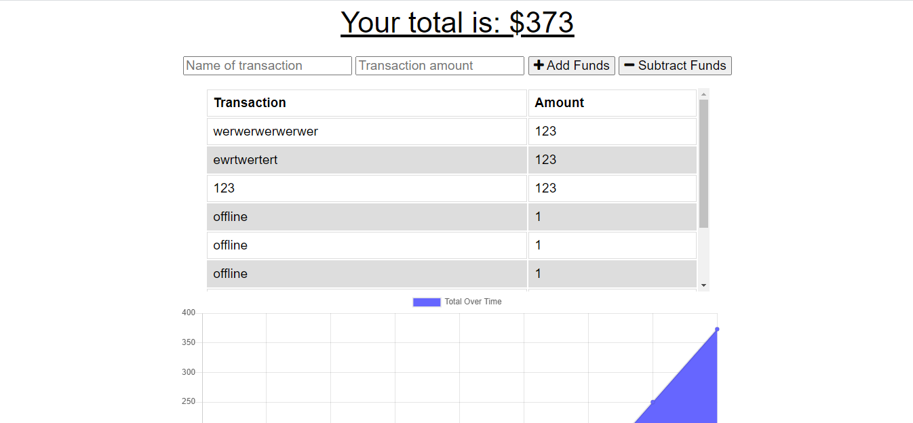

[MIT License](https://choosealicense.com/licenses/mit/)

# Budget Tracker

## Table of Contents
1. [Description](#description)
2. [Technology](#technology)
3. [Screenshots](#screenshots)

  
## Description <a name="description"><a/>

This application tracks a users transactions. The user adds the name and amount of the transaction and either adds or subtracts it from the total. The info is logged to the page and also displayed in a graph. 

## Technology <a name="technology"><a/>

-MongoDB
-Express
-JS
-Node.js
-Morgan
-dotenv
-Mongoose

## Screenshots

